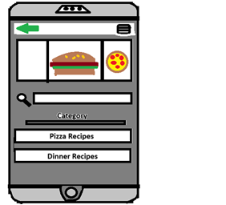
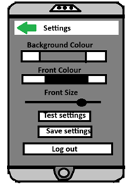
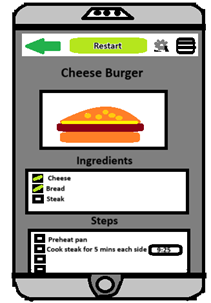
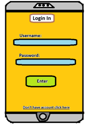
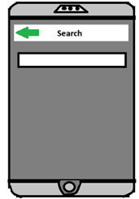

# Reasoning behind my sketches:

## Home page

 •
The home paper prototype is designed for easy access to all functions. The homepage includes a favourites system for quick access to favourite recipes and a search bar limited to searching by category, reducing clutter and maintaining simplicity. The category recycle view complements the search bar to further enhance usability.
 •
 •
 •

## Setting Page

 •
The settings page was designed to be accessible and user-friendly, recognising that some users encounter difficulties with configuration in certain applications. My objective was to keep the layout as visually streamlined as possible, informed by feedback from individuals who find navigating settings challenging. This consideration guided the decision to adopt a simple and intuitive design. 
 •
 •
 •

## Recipe Holder Page

 •
The recipe view was designed for maximum convenience. The implementation of a checkbox system enables users to easily track their progress. Additionally, the restart button is positioned at the top to facilitate a quick reset of all checkboxes.
 •
 •
 •

## Login in Page

 •
While I would prefer the app to function primarily offline, I recognise the necessity of implementing online synchronisation to enable users to access their recipes across multiple devices. For example, if a user acquires a new phone, having their recipes stored both locally and online ensures they can easily download their database to the new device, thereby preventing the loss of any recipes.
 •
 •
 •

## Search Page

 •
Among all the pages in the app, the search page raised concerns because it could affect the app’s intended simplicity. Since one of the app's principles is to remain as uncluttered as possible, displaying many different recipes through the search function had the potential to create a cluttered interface. As a solution, the main search engine was placed on a separate page to prevent the other pages from becoming cluttered.
 •
 •
 •